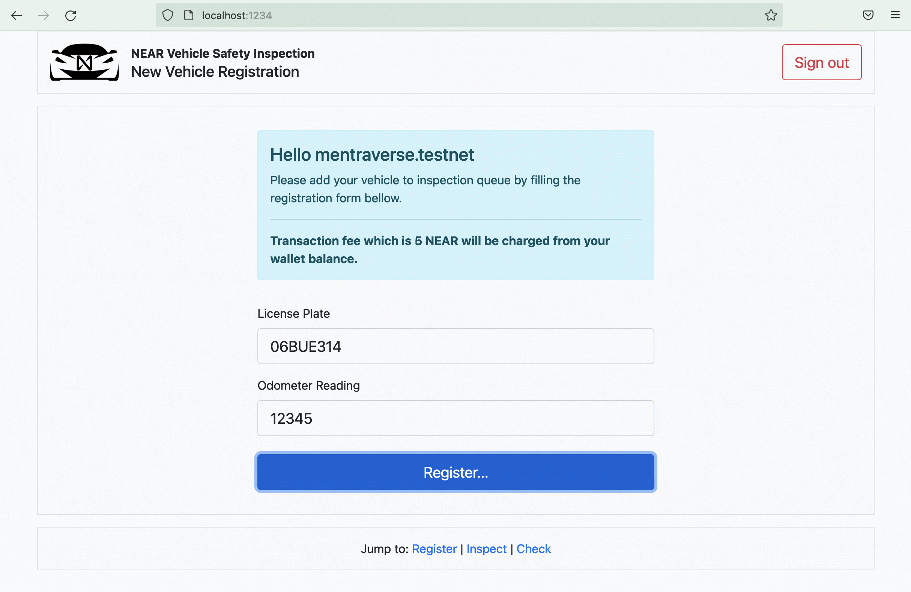
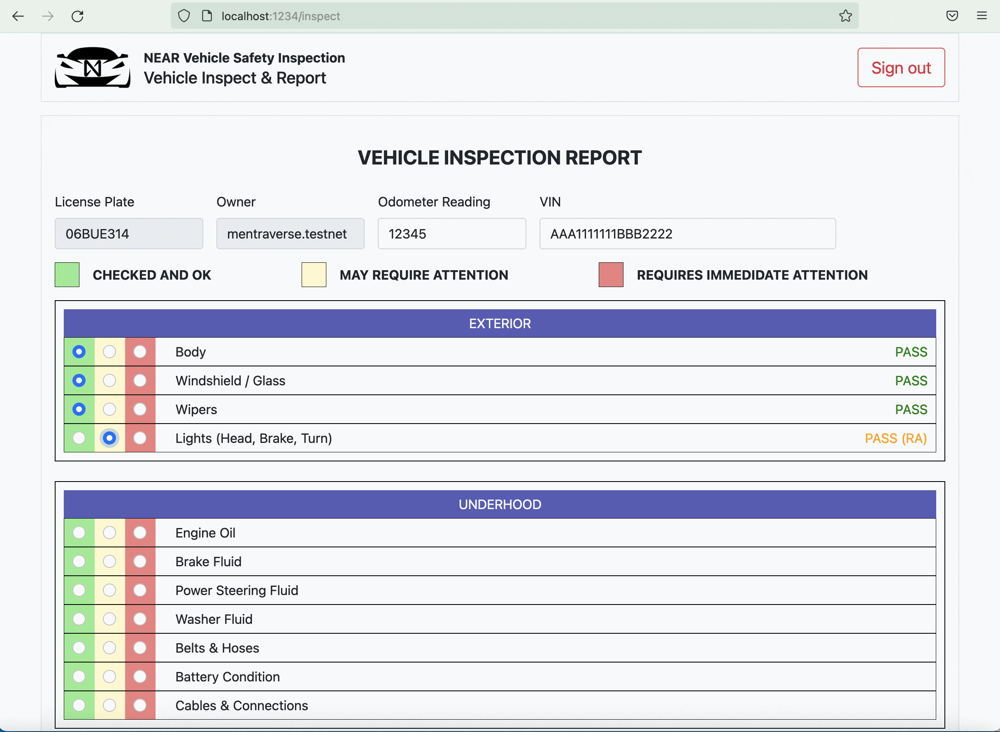
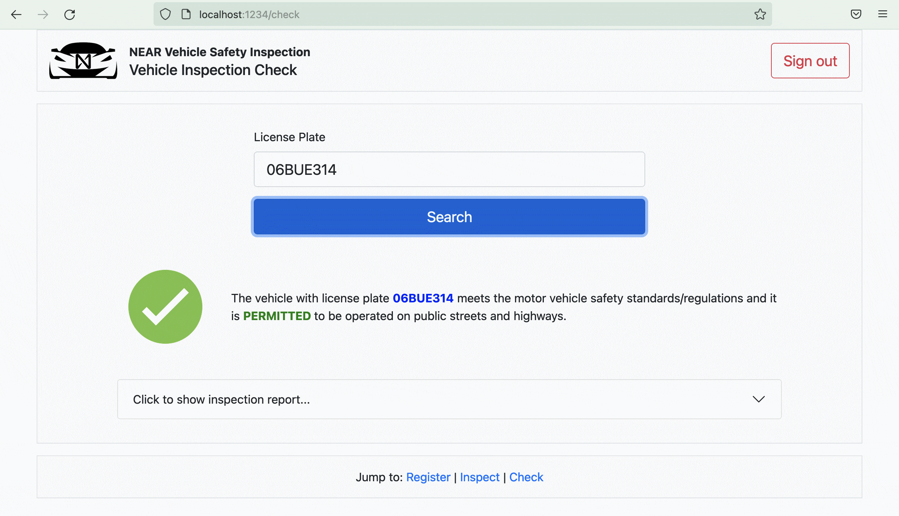

# NEAR Vehicle Safety Inspection

NEAR Vehicle Safety Inspection dApp offers a complete solution for Periodical Motor Vehicle Inspections including vehicle registration, financial operations, inspection, reporting and report checking.

Backend has been coded by using the [AssemblyScript], frontend interface [react]. 

# Table of Contents  
1. [Description](#description)
2. [Usage](#usage)
3. [Contract](#contract)
4. [The File System](#the-file-system)
5. [Quick Start](#quick-start)
6. [Deploy](#deploy)
7. [Future Development](#future-development)
8. [Troubleshooting](#troubleshooting)
9. [Author](#author)

# Description

Periodic Motor Vehicle Safety Inspection is a mandatory procedure in many countries. These inspections ensure that vehicles are adapted to certain standards of security and  provides us with the safety of human life and that of the environment. 

NEAR Vehicle Safety Inspection includes all the frontend interface and contracts used for a Periodic Motor Vehicle Safety Inspection. To register and get in the queue, to pay for the transaction fee, to create inspection report and to store on NEAR blockchain and to access all the necessary information when asked for or to be checked anywhere in the world. 

NEAR Vehicle Safety Inspection aims to be prominent by its qualifications such as being transparent and open to be questioned, 100% uptime and creating financial operations seamlessly by using blockchain technology. 

# Usage

NEAR Vehicle Safety Inspection dApp consists of three fundamental components. 

1. New Vehicle Registration : It is the component where a motor vehicle is registered at the time of inspection and transaction fee is paid. Owner of the vehicle registers and puts his/her vehicle in the inspection line by signing in NEARWallet and entering license plate number and odometer reading data. In the meantime, transaction fee is transferred to contract owner’s wallet from the vehicle owner’s. 

   This component can be accessed via root ("/").

   

2. Vehicle Inspect & Report : It is the component where motor vehicles are taken to inspection due to their  place in order and where the inspection reports are prepared. Reports are filled out according to the vehicle taken and it is saved on blockchain. 

   This component can be accessed via “/inspect” path. 

   

3. Vehicle Inspection Check : It is the component where registered inspection reports are questioned. If any, reports that are saved on blockchain are accessed by entering the license plate number. 

   This component can be accessed via “/check” path.

   

# Contract

```JavaScript

// 
// to add new vehicle to inspection queue.
//

function addVehicle(licensePlate: string, odo: string): void

// 
// to get first vehicle from inspection queue.
//

function popVehicle(): RegisteredVehicle

// 
// to get lenght of inspection queue.
//

function getQueueLength(): number {

// 
// to store inspection report to NEAR blockchain.
//

function saveInspectionReport(
  licensePlate: string,
  owner: string,
  odo: string,
  vin: string,
  controlResults: string
): void

// 
// to get inspection report of vehicle with entered license plate.
//

export function getInspectionReport(
  licensePlate: string
): InspectionReport | null
```

# The File System

Please note that boilerplate project configuration files have been ommitted from the following lists for simplicity.

```
.
├── README.md                                      <-- This file
├── contract                                         
│   └── assembly
│       ├── __tests__                              <-- Contract unit tests   
│       │   ├── mainFunctions.unit.spec.ts           
│       │   ├── modelInspectionReport.unit.spec.ts   
│       │   └── modelRegisterVehicle.unit.spec.ts    
│       ├── index.ts                               <-- Contract  
│       └── model.ts                               <-- Classes & collections 
├── screenshots                                    <-- Some front-end screenshots
│   ├── new_vehicle_registration.gif
│   ├── vehicle_inspect_report.gif
│   └── vehicle_inspection_check.gif
└── src
    ├── App.js                                     <-- Main application (App component)
    ├── ControlList.json                           <-- Checklist data for vehicle inspection (JSON)
    ├── __mocks__
    │   └── fileMock.js                            <-- Required for UI tests
    ├── assets
    │   ├── fail.png
    │   ├── favicon.ico
    │   ├── near_vi_logo.png
    │   └── pass.png
    ├── components                                 <-- Fundamental components 
    │   ├── CheckVehicle                            <- Vehicle Inspection Check                     
    │   │   ├── CheckVehicle.css                      
    │   │   └── CheckVehicle.jsx
    │   ├── InspectVehicle                          <- Vehicle Inspect & Report
    │   │   ├── InspectVehicle.css
    │   │   ├── InspectVehicle.jsx
    │   │   └── components                          <- Sub-compoments for report generation 
    │   │       ├── ControlRow.css
    │   │       ├── ControlRow.jsx
    │   │       └── InspectionReport.jsx
    │   └── RegisterVehicle                         <- New Vehicle Registration
    │       └── RegisterVehicle.jsx
    ├── config.js                                  <-- NEAR config
    ├── index.html                                  
    ├── index.js                                   <-- NEAR init.
    └── tests
        ├── integration                              
        │   └── app-integration.test.js            <-- Integration tests
        └── ui
            └── app-ui.test.js                     <-- UI tests
```

# Quick Start

To run this project locally:

1. Prerequisites: Make sure you've installed [Node.js] ≥ 12
2. Install dependencies: `yarn install`
3. Run the local development server: `yarn dev` (see `package.json` for a
   full list of `scripts` you can run with `yarn`)

Now you'll have a local development environment backed by the NEAR TestNet!

Go ahead and play with the app and the code. As you make code changes, the app will automatically reload.

# Deploy

Every smart contract in NEAR has its [own associated account][near accounts]. When you run `yarn dev`, your smart contract gets deployed to the live NEAR TestNet with a throwaway account. When you're ready to make it permanent, here's how.

## Step 0: Install near-cli (optional)

[near-cli] is a command line interface (CLI) for interacting with the NEAR blockchain. It was installed to the local `node_modules` folder when you ran `yarn install`, but for best ergonomics you may want to install it globally:

    yarn install --global near-cli

Or, if you'd rather use the locally-installed version, you can prefix all `near` commands with `npx`

Ensure that it's installed with `near --version` (or `npx near --version`)

## Step 1: Create an account for the contract

Each account on NEAR can have at most one contract deployed to it. If you've already created an account such as `your-name.testnet`, you can deploy your contract to `ncd-vehicle-inspection.your-name.testnet`. Assuming you've already created an account on [NEAR Wallet], here's how to create `ncd-vehicle-inspection.your-name.testnet`:

1. Authorize NEAR CLI, following the commands it gives you:

   near login

2. Create a subaccount (replace `YOUR-NAME` below with your actual account name):

   near create-account ncd-vehicle-inspection.YOUR-NAME.testnet --masterAccount YOUR-NAME.testnet

## Step 2: set contract name in code

Modify the line in `src/config.js` that sets the account name of the contract. Set it to the account id you used above.

    const CONTRACT_NAME = process.env.CONTRACT_NAME || 'ncd-vehicle-inspection.YOUR-NAME.testnet'

## Step 3: deploy!

One command:

    yarn deploy

As you can see in `package.json`, this does two things:

1. builds & deploys smart contract to NEAR TestNet
2. builds & deploys frontend code to GitHub using [gh-pages]. This will only work if the project already has a repository set up on GitHub. Feel free to modify the `deploy` script in `package.json` to deploy elsewhere.

# Future Development
Promising feature development ideas;

- An authentication feature could be added to Vehicle Inspection & Report component so that only designated inspectors can use it.
- Inspectors could be charged per report they fill out.
- Inspection report could be sent to the vehicle owner's wallet as NFT.

# Troubleshooting

On Windows, if you're seeing an error containing `EPERM` it may be related to spaces in your path. Please see [this issue](https://github.com/zkat/npx/issues/209) for more details.

# Author

- Okan Serkan Erkan ( ose @ mentraverse . io )  
Made with ❤️ in decenteralized world! 

[near protocol]:https://near.org
[assemblyscript]:https:/www.assemblyscript.org
[react]: https://reactjs.org/
[create-near-app]: https://github.com/near/create-near-app
[node.js]: https://nodejs.org/en/download/package-manager/
[near accounts]: https://docs.near.org/docs/concepts/account
[near wallet]: https://wallet.testnet.near.org/
[near-cli]: https://github.com/near/near-cli
[gh-pages]: https://github.com/tschaub/gh-pages
[turkiye]: https://goturkiye.com/